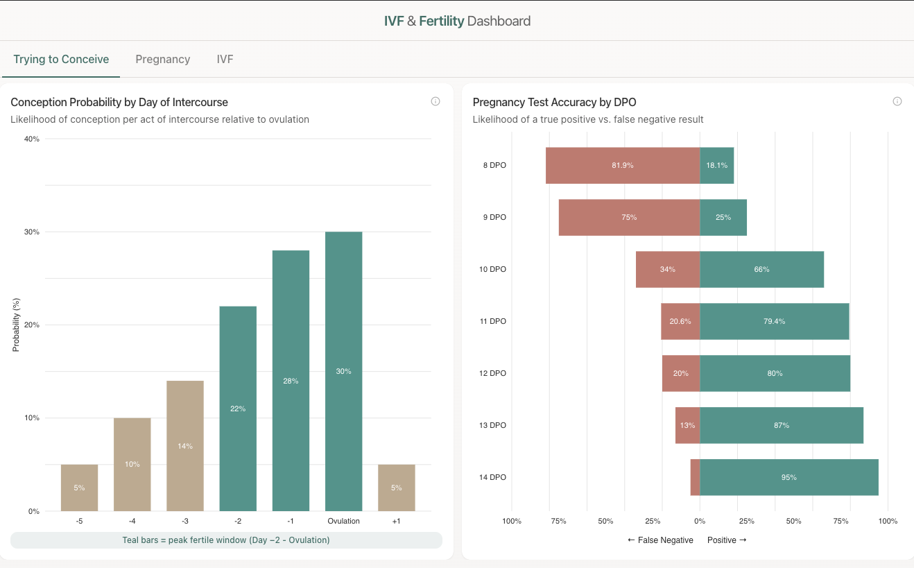
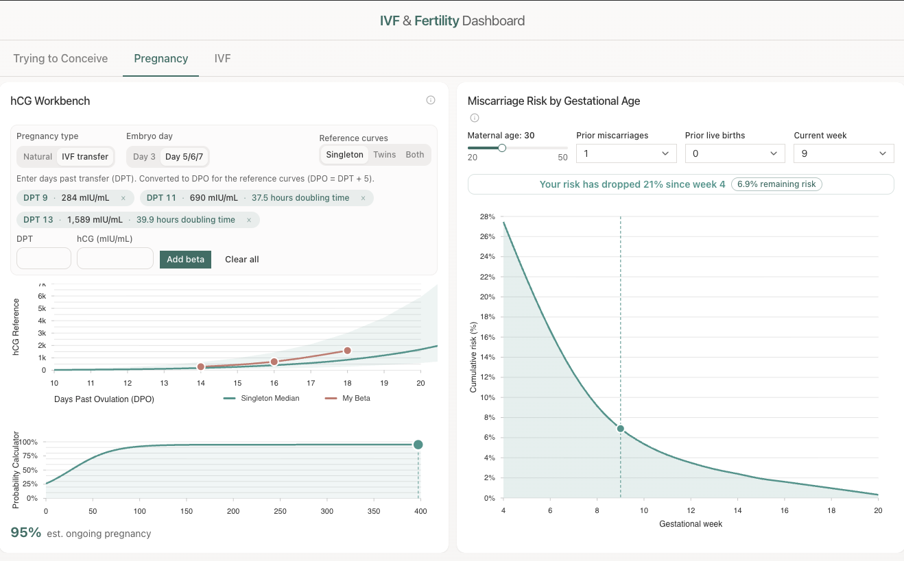
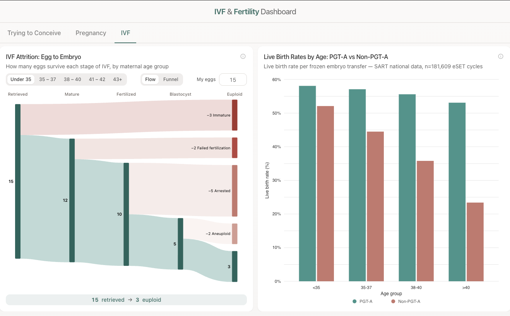

# IVF Data Hub

A data visualization dashboard exploring real IVF and fertility datasets — CDC clinic outcomes, hCG reference curves, and evidence-based miscarriage risk modeling. Built to demonstrate full-stack data engineering from raw public APIs to interactive, chart-driven UI.

Live site: https://fertilitydashboard.netlify.app/

## Screenshots

### Trying to Conceive



- **Conception Timing Chart** — cycle-day probability visualization
- **DPO Test Accuracy** — pregnancy test accuracy by days past ovulation

### Pregnancy



- **HCG Workbench** — hCG level trends and reference ranges
- **Miscarriage Risk Chart** — risk trajectory by gestational week

### IVF



- **IVF Attrition Sankey** — funnel from retrieval to live birth
- **Success Rates by Age** — outcome rates across age groups
- **Clinic Explorer** — compare clinic-level statistics

## Stack

| Layer | Technology |
|-------|-----------|
| Framework | React 18 + TypeScript |
| Build | Vite |
| Styling | Tailwind CSS v3 + shadcn/ui (Radix primitives) |
| Charts | Nivo (d3-based) |
| Data | TanStack Query v5 |
| Animation | Framer Motion |
| Testing | Vitest |

## Architecture

```
src/
  components/
    charts/        # Stateless Nivo chart wrappers — data in via props, no fetching
    dashboard/     # Layout grid, animated panel containers
    filters/       # Age, state, date selectors
    ui/            # shadcn/ui primitives (auto-generated)
  hooks/           # TanStack Query fetchers + URL-synced filter state
  lib/
    transforms.ts  # Raw API data → Nivo-ready shapes (tested)
    miscarriageModel.ts  # Probability curve math from peer-reviewed lit (tested)
    hcgData.ts     # Static Betabase hCG reference data
    constants.ts   # Color palette, Nivo theme, age brackets
  types/           # Shared TypeScript types for API responses + chart props
```

**Key design decisions:**

- Chart components never fetch data — all shaping happens in `transforms.ts`, all fetching in `hooks/`
- Miscarriage model implements hazard-rate math from Tong 2008, Avalos 2012, and Magnus 2019 with age/history multipliers
- 110 unit tests covering both transform and model logic

## Data Sources

| Source | Type | Description |
|--------|------|-------------|
| [CDC NASS ART](https://data.cdc.gov/resource/9tjt-seye.json) | Live API | National IVF success rates by clinic, age, and procedure type |
| Betabase | Static | hCG reference ranges (DPO 10–28, singleton + twins) |
| Peer-reviewed literature | Computed | Miscarriage probability model (weekly hazard rates, adjusted for age and history) |

## Getting Started

```bash
npm install
npm run dev
```

Run tests:

```bash
npm test
```

## License

MIT
